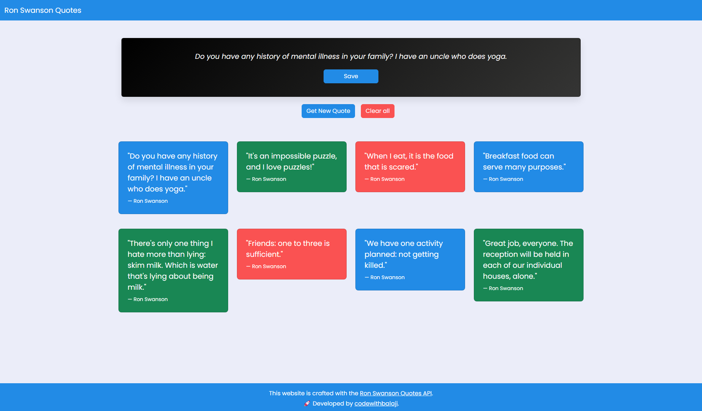

# Ron swanson quotes - React API

## Overview

A simple project created for assessment, utilizing React.js to interact with the Ron Swanson Quotes API. The project renders quotes fetched from the API using React components, showcasing how to integrate external APIs with React.js.

## Installation Guide

Follow these steps to install the Project in your local machine:

1. Clone the repository to your local machine.
2. Navigate to the project directory in your terminal.
3. Install Node.js if not already installed on your system.
4. In the terminal, run `npm install` to install frontend dependencies.
5. Once dependencies are installed, run `npm run dev`.
6. Enjoy!

## Sample Video

- **Screenshots**
  
